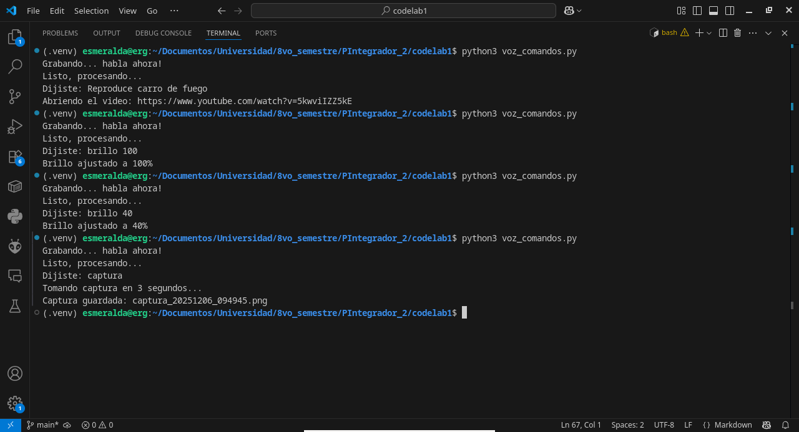
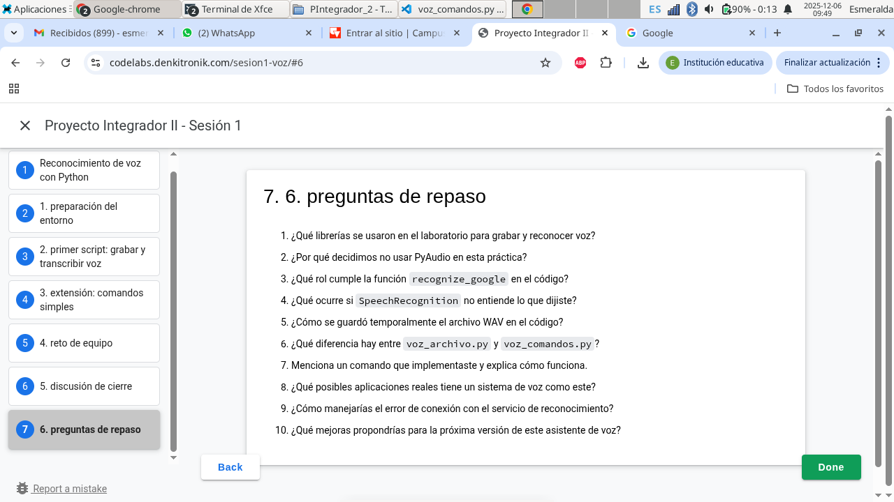

## Estudiantes 
- Jota Emilio Lopez Ramirez - 2259394
- Esmeralda Rivas Guzmán - 2259580

### 1. ¿Qué librerías se usaron en el laboratorio para grabar y reconocer voz?
- ***sounddevice, scipy.io.wavfile:*** Para grabar y guardar audio.
- ***speech_recognition:*** Para procesar y convertir voz a texto.
- ***requests:*** Para descargar HTML de YouTube en el comando reproduce.
- ***pyautogui:*** Para captura de pantalla.
- ***webbrowser, subprocess, re, datetime, tempfile, os***

### 2. ¿Por qué decidimos no usar PyAudio en esta práctica?
***sounddevice*** es más moderno, y no genera problemas de instalación. 

### 3. ¿Qué rol cumple la función recognize_google en el código?
Envía el audio grabado a la API gratuita de Google y devuelve el texto transcrito en español.

### 4. ¿Qué ocurre si SpeechRecognition no entiende lo que dijiste?
Lanza la excepción ***sr.UnknownValueError***, y muestra el mensaje "No se entendió el audio."

### 5. ¿Cómo se guardó temporalmente el archivo WAV en el código?
- ***tempfile.mktemp()*** genera una ruta de fichero temporal.
- ***write()*** guarda el audio  en formato WAV (Formato de archivo de audio digital).

### 6. ¿Qué diferencia hay entre voz_archivo.py y voz_comandos.py?
- ***voz_archivo.py:*** Grabar audio, transcribir y mostrar el texto, sin realizar acciones automáticas.
- ***voz_comandos.py:*** Incluye un parser de comandos que interpreta acciones claves. 

### 8. ¿Qué posibles aplicaciones reales tiene un sistema de voz como este?
- Accesibilidad.
- Anotaciones y transcripción.
- Domótica (Automatización del hogar).

### 9. ¿Cómo manejarías el error de conexión con el servicio de reconocimiento?
Capturando la excepción ***sr.RequestError*** y mostrando un mensaje de “No hay conexión”, de tal manera que se logren diferenciar las diversas causas del error. 

### 10. ¿Qué mejoras propondrías para la próxima versión de este asistente de voz?
- Modelo offline.
- Escucha continua, para comando más largos, o acciones continuas.
- Vinculación con APIs que permitan mejores funcionalidades. 

## Comandos implementados 

### 1. **Reproducir música en YouTube**
- **Comando:** `reproduce [nombre de la canción]`
1. Toma el texto después de la palabra "reproduce".  
2. Busca ese texto en YouTube usando `requests`.  
3. Encuentra el primer enlace válido con `re`.  
4. Abre el video en el navegador con `webbrowser.open()`. 

### 2. **Ajustar el brillo de la pantalla**
- **Comando:** `brillo [valor]`  
1. Extrae el número indicado de brillo.  
2. Lee el brillo máximo permitido en `/sys/class/backlight/.../max_brightness`.  
3. Calcula el porcentaje proporcional.  
4. Usa `subprocess` con `sudo tee` para escribir el nuevo valor en el archivo del sistema.  

### 3. **Captura de pantalla**
- **Comando:** `captura [segundos]`  
1. Verifica si se indicó un número.  
2. Espera esa cantidad de segundos con `time.sleep()` (Por defecto 3 segundos).  
3. Toma la captura con `pyautogui.screenshot()`.  
4. Guarda el archivo con nombre único usando `datetime`.

## Prueba de funcionamiento 
### Detección de comandos

### Comando: Youtube 

### Comando: Brillo
Al ajustar el brillo de la pantalla, no se puede adjuntar alguna captura que demuestre su funcionamiento. Sin embargo, en los comandos se logra observar su reconocimiento.

### Comando: Captura 

