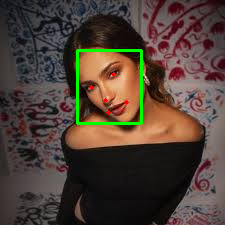
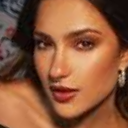
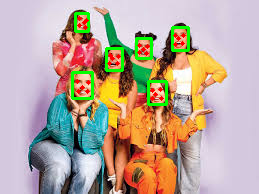
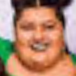
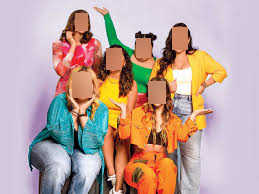
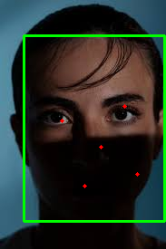
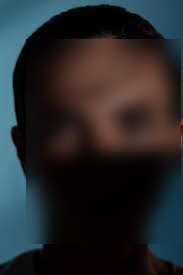

# Codelab MTCNN — Detección y Procesamiento de Rostros

## Colab
[Google Colab](https://colab.research.google.com/drive/1-LkFHHIlQlOqzvivgi16TaxzTzuS7f1n?usp=sharing)

## Tareas realizadas

1. Ejecuta detección en 3 imágenes (1 persona, grupo, rostros parciales).
2. Ajusta el umbral de confianza (0.6 → 0.95) y reporta cuántos rostros quedan.
3. Mide tiempo de inferencia por imagen (promedia 5 corridas).
4. Dibuja landmarks (ojos, nariz, boca) y explica un uso de alignment.
5. (Opcional) Implementa un blur de rostros detectados para privacidad.

---

## Resultados

### Reporte 
`evidence/report.txt`  

---

## Imagen 1 - (1 persona)

**Tiempo promedio:** 211.0 ms
**Detecciones totales:** 1  

| Umbral | Rostros detectados |
|--------|---------------------|
| 0.60   | 1 |
| 0.70   | 1 |
| 0.80   | 1 |
| 0.90   | 1 |
| 0.95   | 1 |

- **Detección:**  
  
- **Alineado:**  
  
- **Blur:**  
  

---

## Imagen 2 — (Grupo)

**Tiempo promedio:** 189.1 ms
**Detecciones totales:** 6  

| Umbral | Rostros detectados |
|--------|---------------------|
| 0.60   | 6 |
| 0.70   | 6 |
| 0.80   | 6 |
| 0.90   | 6 |
| 0.95   | 6 |

- **Detección:**  
  
- **Alineado:**  
  
- **Blur:**  
  

---

## Imagen 3 — (Rostros parciales)

**Tiempo promedio:** 164.2 ms
**Detecciones totales:** 1  

| Umbral | Rostros detectados |
|--------|---------------------|
| 0.60   | 1 |
| 0.70   | 1 |
| 0.80   | 1 |
| 0.90   | 1 |
| 0.95   | 1 |

- **Detección:**  
  
- **Alineado:**  
  
- **Blur:**  
  

