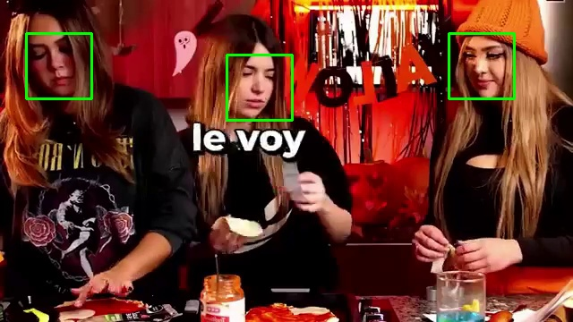
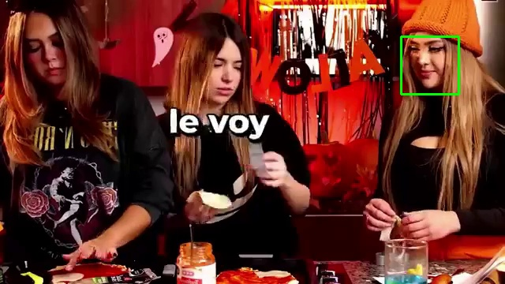
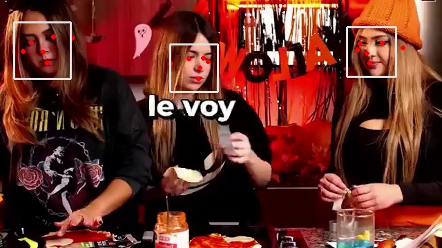

# Codelab MTCNN — Detección de Rostros (Video)

## Colab
[Google Colab](https://colab.research.google.com/drive/1Ar9y3ydxSEmF2gwm11sDNd1jfXbDIRCv?usp=sharing)

## Tareas

1. Prueba con detector(gray, 1) (upsampling) y compara detecciones/FPS.
2. Calcula FPS promedio en 200 frames y repórtalo.
3. (Opcional) Aplica un tracker cv2.KCF para mantener la caja entre frames.

---

## Resultados

## Detección 

## Upsampling
- Upsample = 0 -> FPS: 15.878103165286607 Detecc: 162

- Upsample = 1 -> FPS: 6.133270534988829 Detecc: 733

## Tracker 

## Primer intento - Tracking con OpenCV (KCF) 

## Segundo intento - Tracking implícito con MediaPipe

