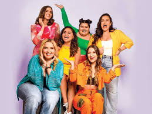
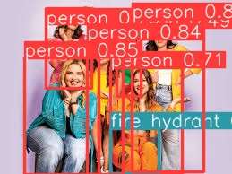
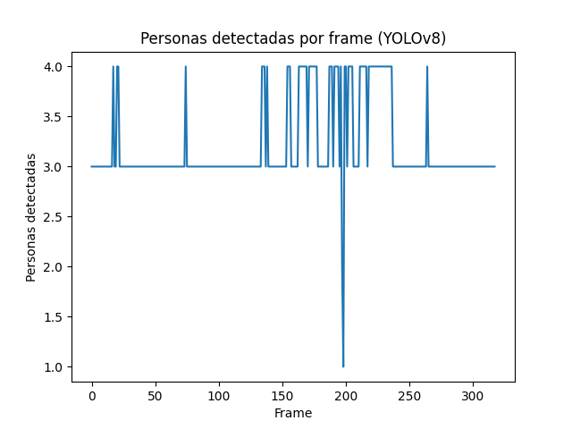

# Detección de objetos en imagenes con yolo lite

## Resultados 

## Imagen para pruebas

## Probar YOLO-lite en una imagen

##  Exportar resultados a JSON

[Ver reporte](./evidence/resultados.json)

## Reto 

## Video de 10 segundos para prueba

<video src="evidence/video.mp4" controls width="600">
    Tu navegador no soporta la reproducción de video.
</video>

## Detecciones de diversas clases (JSON)

[Ver reporte](./evidence/detecciones_video.json)

## Gráfico 

