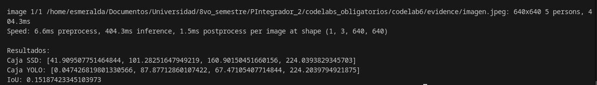
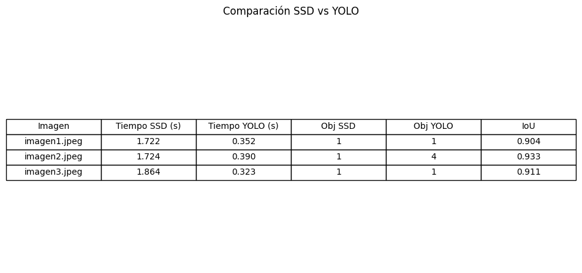
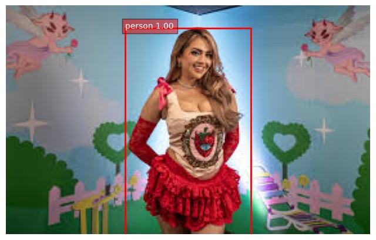
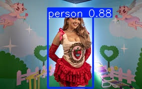
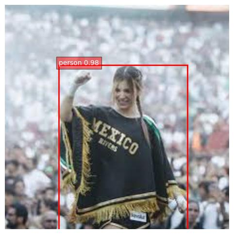
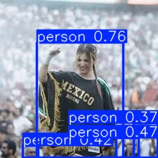
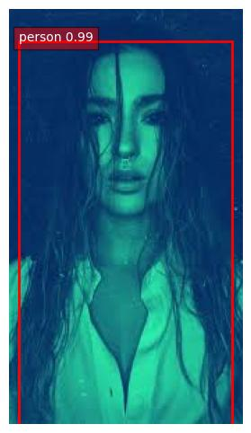

# Detección de objetos con SSD 

## Imagen original para prueba inicial 

## Correr SSD en una imagen
[Ver reporte](./evidence/resultados_imagen.txt)

## Visualizar resultados de SSD

## Comparación con YOLO-lite 

## Calcular IoU simple 

## Reto 

En este caso se seleccionaron 3 imagenes para la comparación, teniendo esta tabla como resultado:

Asímismo, se presenta a continuación la detección realizada por SSD y Yolo 

### Imagen 1 (SSD)

### Imagen 1 (Yolo)

### Imagen 2 (SSD)

### Imagen 2 (Yolo)

### Imagen 3 (SSD)

### Imagen 3 (Yolo)

## Modelo para proyecto 

Después de comparar ambos modelos en varias imágenes, YOLOv8 mostró tiempos de inferencia  menores que SSD, lo cual lo hace más adecuado para aplicaciones en tiempo real, al ser más eficiente y rápido. Además, en la imagen 2 logra detectar más objetos que SSD.

