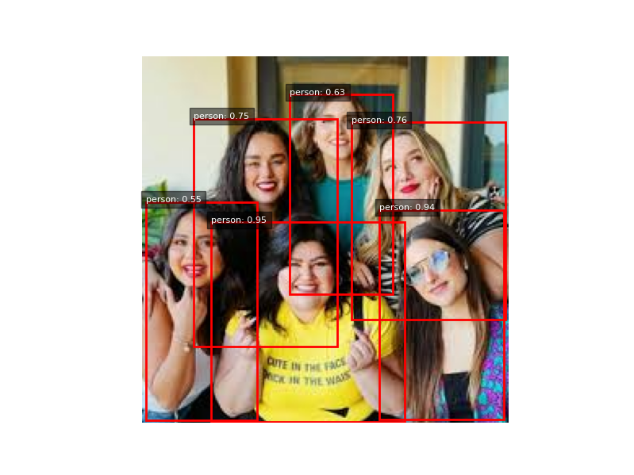
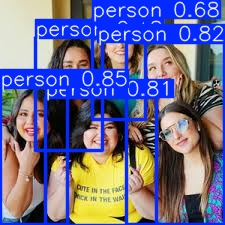

# Detección de objetos con SSD 

## Imagen original para prueba inicial 

## Correr SSD en una imagen
[Ver reporte](./evidence/resultados_imagen.txt)

## Visualizar resultados de SSD

## Comparación con YOLO-lite 

## Calcular IoU simple 
