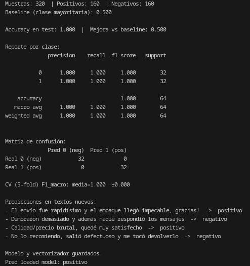
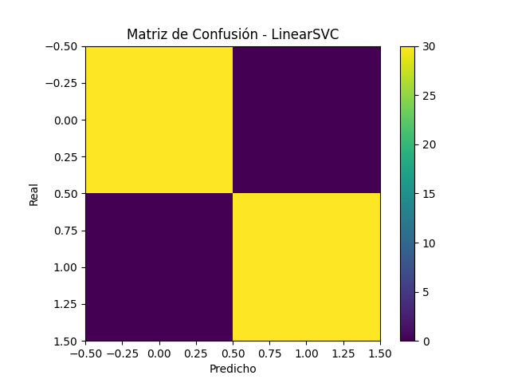
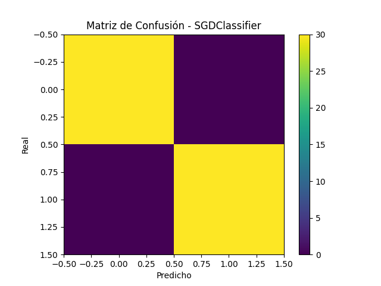
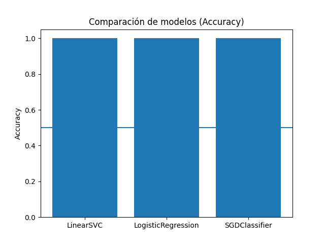
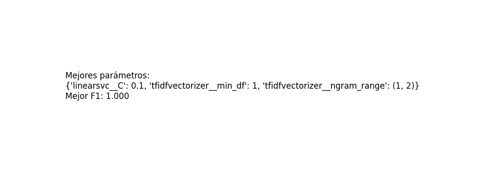

# Clasificador de comentarios de un negocio 

## Resultados

## Entrenamiento 

Se entrenaron y compararon tres modelos:
1. LinearSVC
2. Logistic Regression
3. SGDClassifier

## Matrices de confusión 

## Comparación 

## Búsqueda de hiperparámetros

